# Tui-pages

> [!IMPORTANT]
> Read this docs, its handwritten

> **Origin:** Originally developed for TUI accounting system. This crate was extracted and optimized from it using AI(thank you claude, chatgbt and minimax).

## Docs:
```
git submodule update --init --recursive
mdbook serve mdbook --open
```
## Motivation
You want to create complex TUI app? Me too. I did it and was stuck with god object mutating shared reference everywhere.(I know, skill issues). So I had to rewrite the whole architecture.    

This crate it that architecture. Asked AI to generalize so that you can also use it ;)

## Actual docs
### How it worked before the generalization:


Simply:

User pressed keybinding("ctrl+s" - handled by KeyEvent), or any keyboard letter. That is flushed into InputPipeline.

InputPipeline - maps typesafe Command::Save to string from KeyEvent or keyboard.

InputOrchestrator - decides where the user request should go. E.g. we press "j" for Movement::Down. This request is to be processed by FocusManager. So we just go there. 

FocusManager [IMPORTANT] - this handles focus. Of the whole app. Like it holds everything. So if library wants focus, its a problem, there is system inside of it for that. But if you want to focus element, you simply tell focus manager. You are not doing it on your own, be dumb, let this do the work for you.

CommandPipeline - I forgot, who cares

ActionDecider - Who does what

Executor - function lives in the login page for login. We should login. So executor does call this function from the login page. Its a simple function call.

## Architecture

(Dont even read this, its done by Opus, its for the LLMs)
See [`docs/architecture/architecture.md`](docs/architecture/architecture.md)
for the full design, flow diagrams, and the primitive layer.
