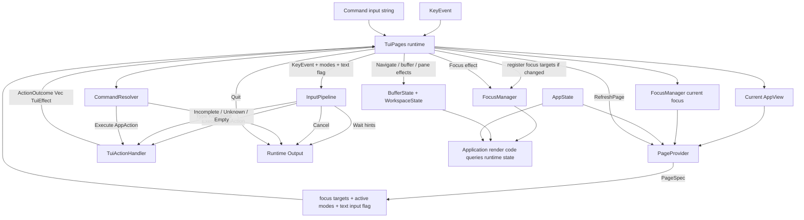
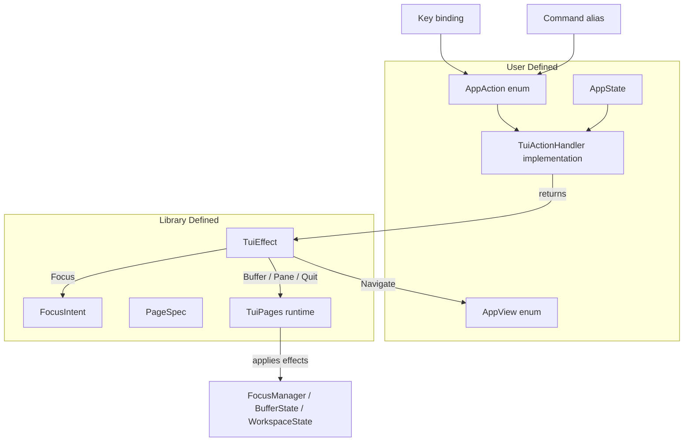

# tui-pages Architecture

`tui-pages` is a coordination runtime for keyboard-driven, page-based TUI
applications. There is one architecture: the `TuiPages` runtime facade. The
lower-level primitives it is built from (`InputPipeline`, `CommandResolver`,
`FocusManager`, `BufferState`, `WorkspaceState`, `NavigationCoordinator`) are
exported for advanced callers who want to wire the flow themselves, but the
facade is the intended entry point.

## Core Idea

The application owns its actions.

```rust
enum AppAction {
    Save,
    OpenSettings,
    MoveSelectionDown,
    Quit,
}
```

The library does not know what those actions mean. Key maps and commands only
resolve key events / command input to application actions.

The application handler interprets those actions and returns library effects.

```rust
match action {
    AppAction::OpenSettings => ActionOutcome::effect(TuiEffect::Navigate(AppView::Settings)),
    AppAction::MoveSelectionDown => ActionOutcome::effect(TuiEffect::Focus(FocusIntent::Next)),
    AppAction::Quit => ActionOutcome::effect(TuiEffect::Quit),
    AppAction::Save => {
        save(state);
        ActionOutcome::none()
    }
}
```

This keeps action names fully application-owned while the library coordinates
focus, navigation, buffers, panes, overlays, and command handling. The library
classifies nothing as "page" / "canvas" / "global" — if an application wants
that distinction it encodes it in its own `AppAction` or handler logic, using
the focus available in `ActionContext`.

## Runtime Flow



## Action And Effect Flow



## Primitive Layer

The facade composes these primitives. They are documented in their own
diagrams for advanced callers:

- [`input_pipeline.mermaid`](input_pipeline.mermaid) — key chords, sequence
  tracking, key maps, and pipeline responses.
- [`focus.mermaid`](focus.mermaid) — focus target registration and the single
  source of focus truth.
- [`navigation_coordinator.mermaid`](navigation_coordinator.mermaid) — the
  lower-level buffer/router/focus synchronization used when an application
  drives navigation manually instead of through `TuiEffect`.

## What The Application Registers

The application feeds the runtime:

- initial view
- fallback view (optional)
- page provider
- action handler
- key maps
- commands

```rust
let mut runtime = TuiPages::<AppView, AppAction, AppState>::builder(AppView::Home)
    .pages(MyPages)
    .handler(MyHandler)
    .bind(modes::GENERAL, "tab", AppAction::FocusNext)
    .bind(modes::GENERAL, "s", AppAction::OpenSettings)
    .command("Quit", ["q", "quit"], AppAction::Quit)
    .build();
```

Any key or command can map to any action. The library does not define
application actions.

## Modes

Modes are plain identifiers (`ModeId`). The `modes` module provides common
presets (`GENERAL`, `GLOBAL`, `COMMAND`, `INSERT`, …) but applications can
define their own with `ModeId::owned`. The set of active modes for a key event
comes from the current page's `PageSpec`, so focus and state drive which
bindings are live. Focus targets do not dictate modes.

## What The Runtime Owns

`TuiPages` owns:

- `InputPipeline<AppAction>`
- `CommandResolver<AppAction>`
- `FocusManager`
- `BufferState<AppView>` (with `WorkspaceState` panes)
- page provider
- action handler

The runtime applies these effects:

- `TuiEffect::Focus`
- `TuiEffect::Navigate`
- `TuiEffect::NextBuffer`
- `TuiEffect::PreviousBuffer`
- `TuiEffect::CloseBuffer`
- `TuiEffect::SplitPane`
- `TuiEffect::ClosePane`
- `TuiEffect::NextPane`
- `TuiEffect::PreviousPane`
- `TuiEffect::RefreshPage`
- `TuiEffect::Quit`

Rendering, side effects, editor/canvas behavior, dialog/picker payloads, and
all application data remain application-owned.

## Error Model

Applications keep their own handler error type:

```rust
impl TuiActionHandler<AppView, AppAction, AppState> for MyHandler {
    type Error = MyAppError;
}
```

Runtime methods return the exported wrapper:

```rust
TuiPagesResult<TuiPagesOutput<AppAction>, MyAppError>
```

which is an alias for:

```rust
Result<TuiPagesOutput<AppAction>, TuiPagesError<MyAppError>>
```

The runtime error type is intentionally small:

```rust
pub enum TuiPagesError<E> {
    Handler(E),
}
```

This gives consumers one stable result shape while keeping application failures
application-owned. More runtime variants should only be added when the runtime
has real fallible states that should not be represented as no-ops.
