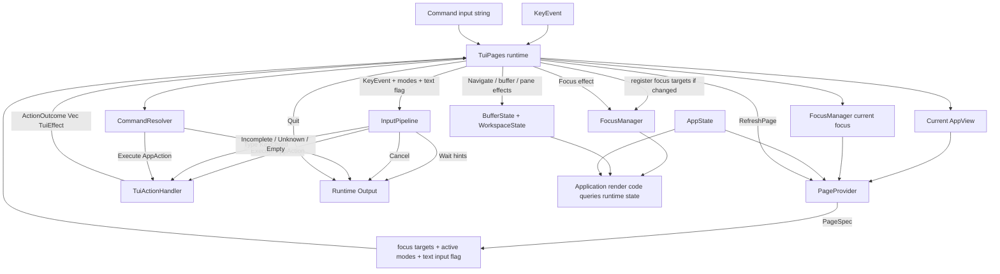
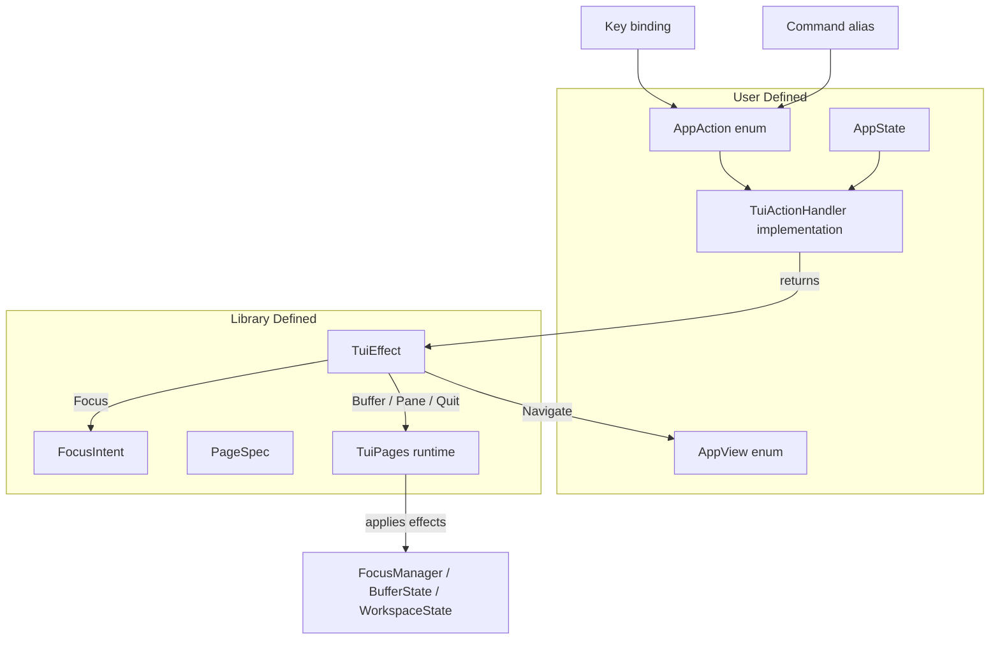

# Runtime Facade System

This document describes the new recommended `tui-pages` system built around
`TuiPages`. It should be read as the replacement top-level architecture for the
old `full_system.mermaid`, `action_decider.mermaid`, and `executor.mermaid`
flows.

The lower-level primitives still exist:

- `InputPipeline`
- `CommandResolver`
- `FocusManager`
- `BufferState`
- `NavigationCoordinator`

The new runtime facade coordinates them so applications do not have to wire the
full flow manually.

## Main Idea

The application owns actions.

```rust
enum AppAction {
    Save,
    OpenSettings,
    MoveSelectionDown,
    Quit,
}
```

The library does not know what those actions mean. Keymaps and commands only
resolve to user actions.

The application handler interprets those actions and returns library effects.

```rust
match action {
    AppAction::OpenSettings => ActionOutcome::effect(TuiEffect::Navigate(AppView::Settings)),
    AppAction::MoveSelectionDown => ActionOutcome::effect(TuiEffect::Focus(FocusIntent::Next)),
    AppAction::Quit => ActionOutcome::effect(TuiEffect::Quit),
    AppAction::Save => {
        save(state);
        ActionOutcome::none()
    }
}
```

This keeps user action names fully application-owned while still letting the
library coordinate focus, navigation, buffers, panes, overlays, and command
handling.

## New Runtime Flow



## New Action And Effect Flow



## What Changed Compared To Original Mermaids

### `full_system.mermaid`

Original top-level flow:

```text
KeyEvent
  -> InputPipeline
  -> InputOrchestrator
  -> ActionDecider
  -> Executor
  -> Canvas / Page / Global
  -> NavigationCoordinator
```

New top-level flow:

```text
KeyEvent
  -> TuiPages runtime
  -> PageProvider / PageSpec
  -> InputPipeline
  -> user AppAction
  -> TuiActionHandler
  -> TuiEffect
  -> FocusManager / BufferState / WorkspaceState
```

Changed:

- `InputOrchestrator` is replaced by `TuiPages` as the public coordination API.
- `ActionDecider` is no longer required in the recommended flow.
- `Executor` is replaced by the user implementation of `TuiActionHandler`.
- `CanvasLogic`, `PageLogic`, and `GlobalLogic` are no longer library-level
  routing concepts in the facade.
- The application decides what each `AppAction` means.
- The library only applies returned `TuiEffect` values.

Still the same:

- `InputPipeline` still resolves key sequences.
- `FocusManager` still owns focus state.
- Buffers, panes, and navigation state are still library-managed.
- Rendering remains application-owned.

### `action_decider.mermaid`

Original flow:

```text
PipelineResponse + FocusTarget + PageIdentifier
  -> ActionDecider
  -> PageLogic / CanvasLogic / GlobalLogic / Type / Wait / Unresolved
```

New flow:

```text
PipelineResponse::Execute(AppAction)
  -> TuiActionHandler
  -> ActionOutcome Vec<TuiEffect>
```

Changed:

- The library no longer classifies actions as page/canvas/global in the facade.
- Focus can still be inspected through `ActionContext`.
- If an app wants page/canvas/global routing, it can encode that inside its own
  `AppAction` or handler logic.

Still the same:

- `Type`, `Wait`, and `Cancel` are still produced by the input pipeline.
- Focus is still available when interpreting actions.

### `executor.mermaid`

Original flow:

```text
ActionResolution
  -> ActionExecutor
  -> route_canvas / route_page / route_global / route_type
  -> AppEvent
  -> apply_event
  -> NavigationCoordinator
```

New flow:

```text
AppAction
  -> TuiActionHandler
  -> ActionOutcome Vec<TuiEffect>
  -> TuiPages::apply_effect
```

Changed:

- There is no separate executor in the recommended facade.
- The handler directly returns effects instead of producing an intermediate
  app event.
- Navigation, focus, buffer, pane, and quit behavior are applied by
  `TuiPages::apply_effect`.

Still the same:

- Application side effects still happen in application code.
- Navigation and focus mutations still happen through library-owned state.

### `input_pipeline.mermaid`

No major conceptual change.

Original:

```text
KeyEvent + modes + config
  -> InputPipeline
  -> Execute / Type / Wait / Cancel
```

New:

```text
KeyEvent + PageSpec modes + PageSpec accepts_text_input
  -> InputPipeline
  -> Execute AppAction / Type / Wait / Cancel
```

Changed:

- Modes now usually come from `PageProvider::page_spec`.
- The action type is fully user-owned.

Still the same:

- Key chord conversion is unchanged.
- Sequence tracking is unchanged.
- Key maps are unchanged.

## What The User Registers

The user feeds the runtime:

- initial view
- fallback view, optional
- page provider
- action handler
- keymaps
- commands

Example shape:

```rust
let mut runtime = TuiPages::<AppView, AppAction, AppState>::builder(AppView::Home)
    .pages(MyPages)
    .handler(MyHandler)
    .bind(modes::GENERAL, "tab", AppAction::FocusNext)
    .bind(modes::GENERAL, "s", AppAction::OpenSettings)
    .command("Quit", ["q", "quit"], AppAction::Quit)
    .build();
```

The user can map any key or command to any action. The library does not define
application actions.

## What The Runtime Owns

`TuiPages` owns:

- `InputPipeline<AppAction>`
- `CommandResolver<AppAction>`
- `FocusManager`
- `BufferState<AppView>`
- page provider
- action handler

The runtime applies these effects:

- `TuiEffect::Focus`
- `TuiEffect::Navigate`
- `TuiEffect::NextBuffer`
- `TuiEffect::PreviousBuffer`
- `TuiEffect::CloseBuffer`
- `TuiEffect::SplitPane`
- `TuiEffect::ClosePane`
- `TuiEffect::NextPane`
- `TuiEffect::PreviousPane`
- `TuiEffect::RefreshPage`
- `TuiEffect::Quit`

## Compatibility Note

The old lower-level modules can remain available for advanced users. The new
runtime facade should be considered the primary API because it captures the full
coordination model in one place while keeping application actions user-owned.
